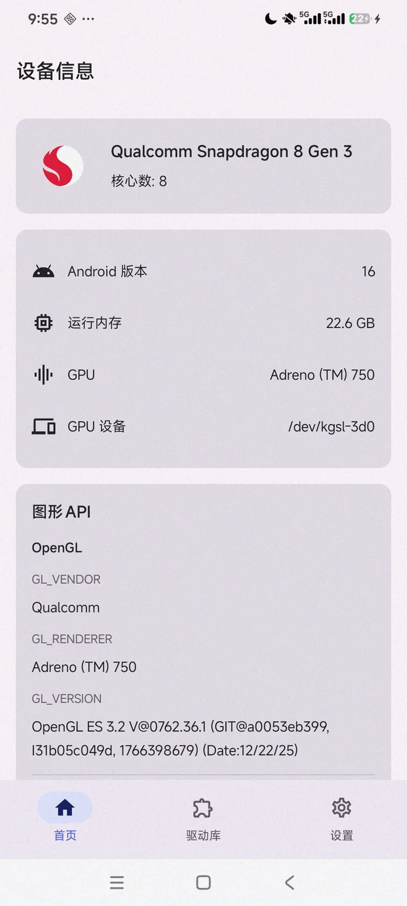
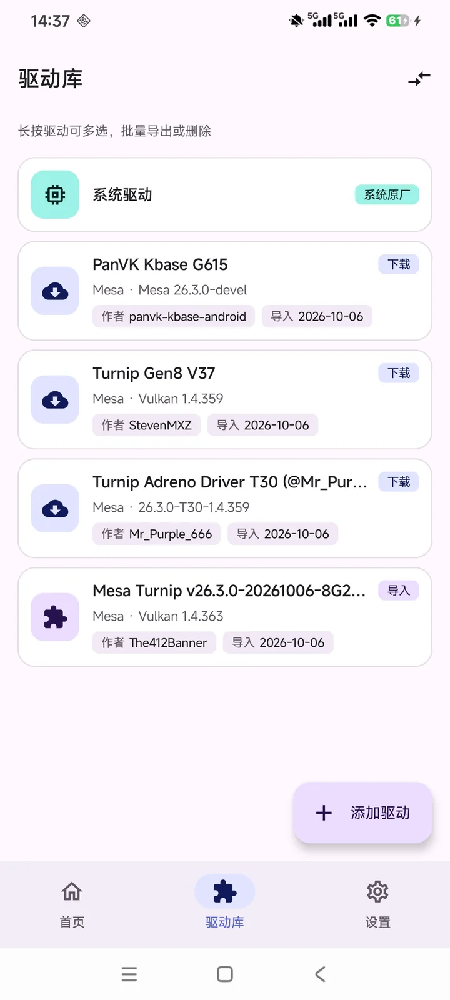

<div align="center">


# Vk Driver Lab

**Inspect, compare, and test Android Vulkan GPU drivers.**

<p>
  
  
  
  
  
</p>
<p>
  <a href="https://github.com/zFitness/driverscope-web/releases/latest"></a>
  <a href="https://zfitness.github.io/driverscope-web/"></a>
  
</p>

[Website](https://zfitness.github.io/driverscope-web/) · [Download](https://github.com/zFitness/driverscope-web/releases/latest) · [中文](README.zh.md)

<p>
  
  
  
</p>

</div>

Vk Driver Lab is an Android tool for inspecting, downloading, importing, comparing, and testing Vulkan GPU drivers — built for emulator gamers and mobile graphics enthusiasts. Everything is non-root: it never modifies system partitions or replaces the stock driver.

## Features
- Device & driver info: SoC, CPU, memory, GPU, Android version, driver name/vendor/version
- Vulkan capability parsing: extensions, Vulkan 1.0–1.4 core features, limits, queue families, memory, image formats
- Driver library: unified model for system, downloaded, and imported drivers
- Built-in source & proxy: filter and download by platform, with GitHub proxy support
- Driver import: safely unpack and parse zip / so packages
- Driver comparison: side-by-side version, extension count, memory, and test results
- Graphics tests & offscreen benchmark: triangle, cube, vkmark, with loaded-driver echo
- Settings & diagnostics: language, proxy, feedback, and raw data export

## Requirements
Android 7.0 (API 24)+ · arm64 · Vulkan · Adreno/Snapdragon · 2GB+ RAM · no root

## Tech
Kotlin + C++ (NDK) · Jetpack Compose · offline Chinese dictionary · signed APK + SHA256

## This repo
Hosts the landing page (static, GitHub Pages) and the **public release anchor**. The app source lives in a private repository; signed APKs are built locally and published to [Releases](https://github.com/zFitness/driverscope-web/releases).

```bash
python3 -m http.server 8080   # preview locally
```

© 2026 zFitness · Vk Driver Lab
